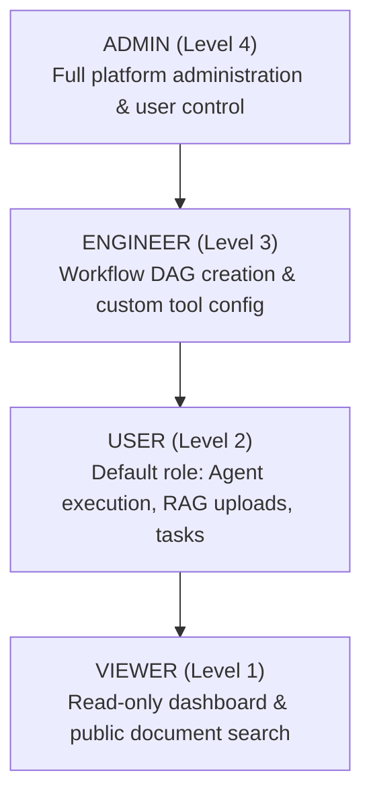

# Authentication & Role-Based Access Control (RBAC) Architecture

AgentForge AI provides production database-backed user authentication and Role-Based Access Control (RBAC) using SQLAlchemy 2.x repositories, PBKDF2 password hashing, and signed JWT Bearer tokens.

## 1. Authentication Endpoints

| Endpoint | Method | Auth Required | Description |
|---|---|---|---|
| `/api/v1/auth/register` | `POST` | No | Register a new user in database and return JWT token. Default role: `USER`. |
| `/api/v1/auth/login` | `POST` | No | Authenticate credentials against database and issue JWT access token. |
| `/api/v1/auth/logout` | `POST` | Yes (Bearer) | Invalidate current user session response. |
| `/api/v1/auth/me` | `GET` | Yes (Bearer) | Retrieve currently authenticated user profile and account stats. |
| `/api/v1/auth/change-password` | `POST` | Yes (Bearer) | Update account password after verifying current password. |

---

## 2. Role Hierarchy & Permissions

The platform defines 4 role levels in `agentforge.auth.roles.UserRole`:



| Role | Hierarchy Level | Capabilities | Default Role? |
|---|---|---|---|
| `ADMIN` | Level 4 | User management, system metrics, dataset deletion, global config. | No |
| `ENGINEER` | Level 3 | Workflow creation, custom tool definition, evaluation execution. | No |
| `USER` | Level 2 | Upload documents, query RAG, execute agent tasks, view personal history. | **Yes** |
| `VIEWER` | Level 1 | Read-only inspection of tasks and document metadata. | No |

---

## 3. Data Isolation & RBAC Enforcement

### A. Authentication Dependency
FastAPI routes declare `current_user: User = Depends(get_current_user)` to automatically extract and validate Bearer tokens from the `Authorization` header.

### B. Role Enforcement Guard
Elevated endpoints use `Depends(require_role(UserRole.ADMIN))` or `Depends(require_role(UserRole.ENGINEER))`. If a user's role level is insufficient, the system returns HTTP 403 Forbidden:
```json
{
  "detail": "Access denied. Operation requires minimum role 'ADMIN', but current role is 'USER'."
}
```

### C. Data Isolation
All user-created documents, tasks, and workflow runs link to `user_id`. Non-admin users are restricted to accessing and modifying only their own resources.
