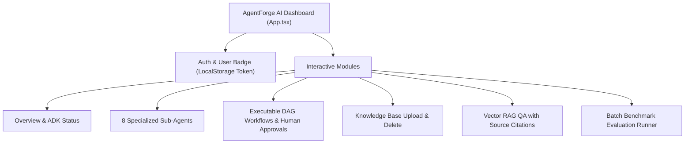

# React Frontend Dashboard & Synchronized API Client Architecture

AgentForge AI features a modern, responsive React + Vite web dashboard built with vanilla CSS design, glassmorphism aesthetics, dark mode palette, dynamic notifications, and a synchronized typed API client (`frontend/src/api/client.ts`).

## 1. Typed API Client Architecture (`frontend/src/api/client.ts`)

The API client abstracts HTTP communication with the FastAPI backend at `/api/v1`:
- **Dynamic Base URL**: Auto-detects local dev (`http://localhost:8000/api/v1`) vs production relative routes (`/api/v1`).
- **JWT Authorization Injector**: Automatically attaches `Authorization: Bearer <token>` from `localStorage` on every request.
- **Typed Endpoint Groups**:
  - `auth`: `register`, `login`, `logout`, `me`, `changePassword`.
  - `health`: `getHealth`, `getReadiness`, `getConfig`.
  - `tasks`: `run`, `getStatus`, `cancel`.
  - `documents`: `upload`, `list`, `get`, `delete`.
  - `rag`: `search`, `ask`, `answer`.
  - `workflows`: `create`, `list`, `get`, `visualize`, `execute`, `getExecution`, `approveCheckpoint`, `rejectCheckpoint`.
  - `evaluations`: `run`, `runBenchmark`, `list`, `getBenchmarks`.

---

## 2. Dashboard Interface Modules



---

## 3. Production Build & Static File Mounting

The React application compiles into `frontend/dist` and is served directly by FastAPI:
```bash
cd frontend
npm run build
```
FastAPI automatically serves the dashboard at `/dashboard`:
```python
frontend_dist = os.path.join(os.path.dirname(__file__), "..", "..", "frontend", "dist")
if os.path.exists(frontend_dist):
    app.mount("/dashboard", StaticFiles(directory=frontend_dist, html=True), name="dashboard")
```
