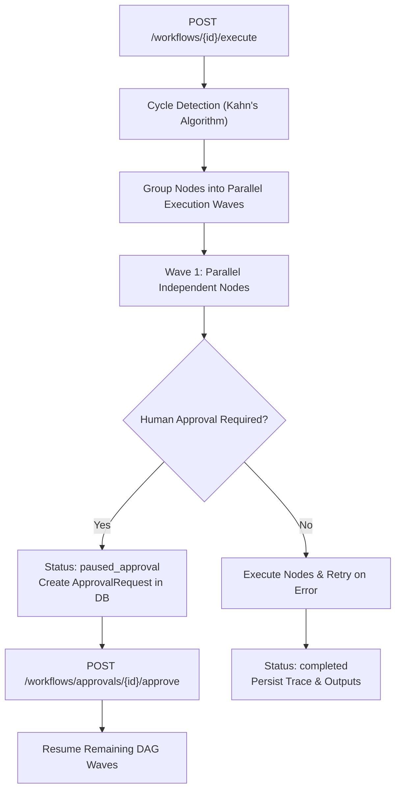

# Executable DAG Workflow Engine Architecture

AgentForge AI features an asynchronous Directed Acyclic Graph (DAG) workflow engine capable of parallel node execution, topological ordering, cycle detection, per-node retries, human-in-the-loop approval pauses, and real-time database state persistence.

## 1. Engine Core Features

- **Topological Sorting**: Kahn's algorithm validates node dependencies (`depends_on`) and groups executable nodes into topological level waves.
- **Cycle Protection**: Throws `CyclicDependencyError` if a circular dependency loop is detected before starting execution.
- **Parallel Wave Execution**: Nodes belonging to the same wave run concurrently via `asyncio.gather`.
- **Node State Machine**: Node status transitions through `pending` ➔ `running` ➔ `completed` / `failed` / `paused_approval`.
- **Human Approval Checkpoint**: When a node is flagged with `requires_approval=True` or `risk_level="DESTRUCTIVE"`, execution safely pauses in `paused_approval` state until an explicit approval token is submitted via API.

---

## 2. API Endpoints

| Endpoint | Method | Description |
|---|---|---|
| `/api/v1/workflows` | `POST` | Create and persist a new DAG workflow graph definition. |
| `/api/v1/workflows` | `GET` | List all saved workflows. |
| `/api/v1/workflows/{id}` | `GET` | Retrieve single workflow graph definition. |
| `/api/v1/workflows/{id}/visualize` | `GET` | Generate Mermaid & ASCII graph diagrams. |
| `/api/v1/workflows/{id}/execute` | `POST` | Trigger execution of DAG workflow graph. |
| `/api/v1/workflows/executions/{execution_id}` | `GET` | Retrieve execution status, node states, and trace logs. |
| `/api/v1/workflows/approvals/{approval_id}/approve` | `POST` | Resume paused workflow execution after human approval. |
| `/api/v1/workflows/approvals/{approval_id}/reject` | `POST` | Reject checkpoint and cancel workflow execution. |

---

## 3. Database Schema Mapping

- **`workflows`**: Stores workflow name, description, `graph_definition` JSON schema, and owner ID.
- **`workflow_executions`**: Tracks active status (`running`, `paused_approval`, `completed`, `failed`), `node_states` JSON snapshot, `inputs`, `outputs`, and error traces.
- **`approval_requests`**: Stores pending approval tokens (`risk_level`, `status`, `approved_by`, `request_payload`).
